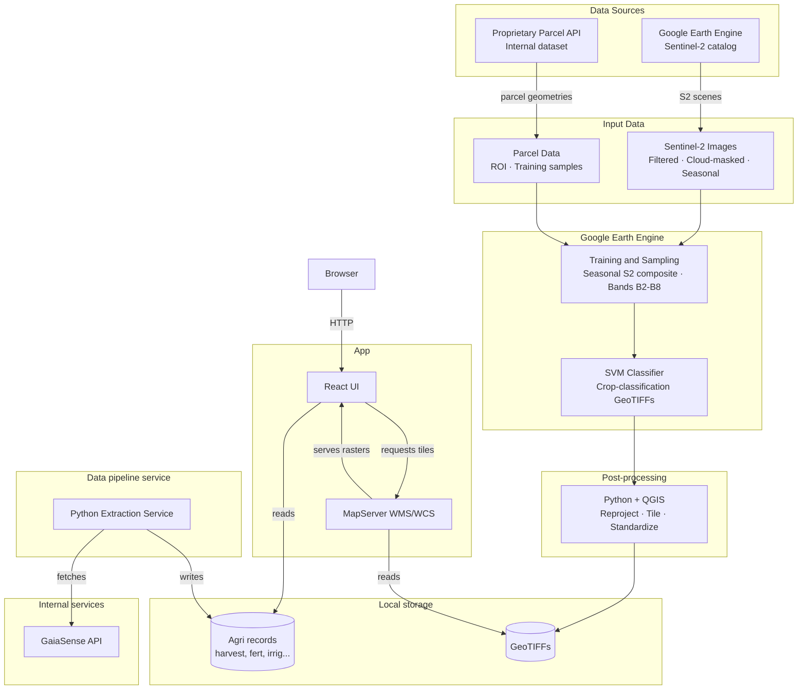

# ScaleAgData UI

The ScaleAgData UI repository contains the frontend application, MapServer configuration, and supporting data extraction scripts used to explore agricultural activity, parcel information, and GeoTIFF layers. The project combines a React dashboard with a MapServer container so users can browse field operations, inspect parcel-level information, and access raster layers through WMS/WCS services.

## Features

- Interactive dashboard: Visualizes parcel-level agricultural data such as fertilization, irrigation, sprays, harvest activity, and NDVI-related views.
- Map-based exploration: Displays parcel geometry and geospatial context in the UI alongside analytical widgets.
- GeoTIFF serving with MapServer: Publishes raster files from the `mapserver/shared/tifs` directory through MapServer using a shared `mapfile.map`.
- WCS download links: Exposes direct `DescribeCoverage` and `GetCoverage` links for GeoTIFF resources from the frontend.
- Data preparation scripts: Includes Python utilities for reorganizing parcel datasets and collecting agricultural event data from the external API.
- Docker-based development setup: Runs the frontend and MapServer together with live-mounted source folders for local development.

## Installation

### Using Docker (recommended)

Clone this repository:

```bash
git clone <your-repository-url>
cd scaleagdataui
```

Build and start the services:

```bash
docker-compose up --build
```

Available services:

- Frontend UI: `http://localhost:3002`
- MapServer: `http://localhost:8080`

### Local setup

Install frontend dependencies:

```bash
cd frontend
npm install
```

Run the frontend locally:

```bash
npm start
```

For the geospatial layer service, run MapServer through Docker from the repository root:

```bash
docker-compose up --build mapserver
```

If you want to use the Python extraction scripts locally, install the required Python packages in your environment and ensure access to the external agricultural API used by the scripts in `data_extraction`.

## Usage

The repository is split into three main areas:

- `frontend/`: React dashboard and UI components
- `mapserver/`: MapServer Docker image, mapfile, and TIFF assets
- `data_extraction/`: Scripts for collecting and reorganizing agricultural source data

Typical development workflow:

1. Start the stack with `docker-compose up --build`.
2. Open the UI at `http://localhost:3002`.
3. Use the dashboard to inspect agricultural metrics and parcel views.
4. Use the MapServer-backed components to request TIFF metadata or download GeoTIFF files.

## Main Component Diagram



## Additional Information

## Architecture

The ScaleAgData UI stack is built with the following technologies:

| Technology | Role |
| --- | --- |
| React | Frontend dashboard and UI rendering |
| Material UI | Layout, styling, widgets, and design system components |
| Leaflet | Parcel and map-based visualization |
| Highcharts | Analytical chart rendering |
| MapServer | WMS/WCS serving for GeoTIFF layers |
| Docker | Containerized local development for frontend and MapServer |
| Python | Data extraction and transformation scripts |

## Data Flow

The platform combines static prepared datasets with geospatial services:

1. The Python scripts in `data_extraction/` reorganize parcel information and fetch agricultural records from the external API.
2. Prepared JSON and spreadsheet-derived files are stored under `frontend/src/dataset/` and consumed by the React application.
3. GeoTIFF files are mounted into the MapServer container from `mapserver/shared/tifs`.
4. The React frontend calls MapServer on port `8080` to retrieve WMS/WCS responses for map display and raster downloads.
5. Users access the UI through port `3002`, where analytical panels and map content are presented together.

## Repository Structure

```text
scaleagdataui/
|-- docker-compose.yml
|-- frontend/
|   |-- src/
|   |-- public/
|   `-- dockerfile
|-- mapserver/
|   |-- environments/
|   |-- shared/
|   |   |-- mapfile.map
|   |   `-- tifs/
|   `-- README.md
`-- data_extraction/
```

## Key Design Decisions

- Frontend and map services are separated into dedicated containers so UI changes and geospatial configuration can evolve independently.
- GeoTIFF assets are mounted as shared files instead of being bundled into the frontend, which keeps raster delivery in the geospatial service layer.
- The React application mixes prepared local datasets with live MapServer requests, reducing frontend complexity while preserving geospatial access.
- Data extraction is kept outside the runtime UI container, allowing source-data collection and transformation to run as a separate preparation step.
- Docker volumes are used for `frontend/src` and `frontend/public` to support local development without rebuilding the image for every UI change.

## Notes

- The root `docker-compose.yml` currently exposes the frontend on host port `3002` and MapServer on host port `8080`.
- The frontend code still contains some legacy references to the old `scale-ag-data` app name in package metadata and UI copy, even though the folder is now named `frontend`.
- Some frontend functionality expects external API connectivity and prepared dataset files to be available.

ScaleAgData Project
This work has been initiated as part of the ScaleAgData-he project. The project receives funding from the European Union's HORIZON Innovation Actions under grant agreement No. 101086355. Views and opinions expressed are however those of the author(s) only and do not necessarily reflect those of the European Union or Research Executive Agency. Neither the European Union nor the granting authority can be held responsible for them.